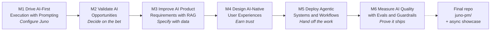

# Storyline — AI Product Management Certification

A simple, sequential read of how the six modules flow together. One narrative, one scenario, one repo.

---

## The opening (M1, first 5 minutes)

> You are the AI PM at **RocketShip** — a hyper-growth B2B SaaS platform for Enterprise Data Teams. On paper, you are winning. In reality, you are the bottleneck of the entire org.
>
> Your inbox is a wall of P0 escalation threads. Support is sitting on thousands of tickets. Sales says deals are stalling because you cannot vet blockers fast enough. Every stakeholder is piling on. You are too buried in the *now* to think about the *what* and *why*.
>
> You have hit the limit of human scale. You have budget for innovation experiments. You have **zero** budget for headcount.
>
> To survive, you cannot scale yourself — you must scale your **judgment**. You will design and build **Juno PM**: an AI Associate PM that lives inside your tools (Slack, Notion, Jira) and handles three pillars: *synthesize insights, draft specs, prioritize risks.*
>
> Over six modules you will configure Juno (M1), validate the bet (M2), spec it with RAG (M3), wrap it in AI-native UX (M4), turn it into a controlled agent (M5), and prove it's shippable with evals (M6). Every artifact you build commits to your own GitHub repo.
>
> You will not leave with a certificate. You will leave with **Juno PM**, in your account, ready to demo Monday morning.

---

## The arc

---

## What you build at each step

| Module | What you do | What you commit |
|---|---|---|
| M1 | Prototype Juno in Lovable; configure its system prompt as a risk watchdog | `01-prompting/system-prompt.md` + Lovable URL |
| M2 | Score Juno's bet on the AI Solution Decision Matrix; write the AI Strategy One-Pager | `02-strategy/decision-matrix.md` + `strategy-one-pager.md` |
| M3 | Specify the RAG architecture in your AI PRD; cite cost / speed / accuracy trade-offs | `03-rag-prd/ai-prd.md` |
| M4 | Architect the AI user flow (visible UI + invisible iceberg); close the three trust gaps | `04-ai-ux/user-flow.md` + screenshots |
| M5 | Write the Agent Workflow Spec — triggers, tools, memory, handoff rules | `05-agentic-workflows/awspec.md` |
| M6 | Plan the eval stack (user + human + automated); finalise repo + async showcase | `06-evals/eval-stack.md` + repo `README.md` |

---

## The provocations (one per module)

- **M1:** "Stop chatting with AI. Start configuring it."
- **M2:** "Most AI features are fake-good. Pressure-test the bet before you waste a quarter."
- **M3:** "Your PRD is missing the data corpus. That's not the engineer's problem — it's yours."
- **M4:** "Chat-in-a-tab is the wrong default. AI-native UX is invisible by design."
- **M5:** "An agent without explicit handoff rules is a liability."
- **M6:** "95% accuracy is a 5% production disaster waiting to happen."

---

## How peer feedback works (without groups)

Every exercise ends with three solo mechanics:

1. **Self-review checklist** — 3–5 bullets you tick against your own artifact.
2. **AI-review prompt** — an explicit prompt you paste into ChatGPT/Claude/Cursor with your artifact attached.
3. **Async share** — commit to your fork, post the repo link + 1-paragraph reflection in `#ai-pm-cohort`. Instructor responds in-thread within ~5 days.

No groups. No partners. No round-robin. The course mirrors how AI PMs actually work: solo, AI-augmented, asynchronously reviewed.

---

## The capstone (M6 closing, 30 min)

You will not stand up in a Zoom and present a deck to a room.

You will:

1. Run your finished `juno-pm/` repo through the M6 AI-review prompt (six lenses: Bet, Autonomy, RAG, UX, Agentic, Evals). Note the weakest lens. Fix or document.
2. Finalise the top-level `README.md` — your one-page pitch.
3. Record a 3-minute Loom walkthrough of the repo.
4. Post the repo URL + Loom in `#ai-pm-cohort`.

Instructor responds in-thread with feedback on application of concepts, credibility & reasoning, clarity, and strategic thinking. Certification grade attached. Done.

---

## What you leave with

- A live, public GitHub repo with 6 folders, 6 artifacts, and a board-ready README.
- A working Lovable prototype URL.
- An optional Langflow agent (`Juno Agent.json` import).
- A reusable AI-review prompt to evaluate any future AI bet against the six lenses.
- The reflexes of an AI-native PM — prompt-as-config, autonomy-as-decision, data-as-spec, invisible-as-default, handoff-as-rule, eval-as-surface.
